<div align="center">
  
  
  
  <p align="center">
    <strong>Autonomous AI-powered system for income generation through intelligent task automation</strong>
  </p>
  
  <p align="center">
    <a href="https://github.com/NickScherbakov/robot/blob/main/LICENSE">
      
    </a>
    <a href="https://github.com/NickScherbakov/robot">
      
    </a>
    <a href="https://github.com/NickScherbakov/robot/stargazers">
      
    </a>
    <a href="https://github.com/NickScherbakov/robot/network/members">
      
    </a>
    <a href="https://github.com/NickScherbakov/robot/commits/main">
      
    </a>
    <a href="https://github.com/NickScherbakov/robot">
      
    </a>
  </p>
  
  <p align="center">
    <a href="#-features">Features</a> •
    <a href="#-quick-start">Quick Start</a> •
    <a href="#-demo">Demo</a> •
    <a href="#-documentation">Documentation</a> •
    <a href="#-contributing">Contributing</a>
  </p>
  
</div>

---

## 📋 Table of Contents

- [✨ Features](#-features)
- [🚀 Quick Start](#-quick-start)
- [📱 Telegram Bot Usage](#-telegram-bot-usage)
- [🌐 REST API](#-rest-api)
- [💰 Payment Configuration](#-payment-configuration)
- [📊 Financial Reporting](#-financial-reporting)
- [📸 Screenshots](#-screenshots)
- [🏗️ Architecture](#️-architecture)
- [🔧 Configuration](#-configuration)
- [🚀 Deployment](#-deployment)
- [🧪 Testing](#-testing)
- [🔒 Security](#-security)
- [📚 Documentation](#-documentation)
- [🤝 Contributing](#-contributing)
- [📄 License](#-license)
- [🌐 Live Demo Website](#-live-demo-website)

---

## 🌟 About

**Earning Robot** is an autonomous AI-powered earning system that operates through a laptop, phone, and internet connection. The robot accepts user requests, executes tasks using external AI APIs (OpenAI, Mistral), automatically handles payments via Stripe, and generates comprehensive financial reports.

## ✨ Features

<table>
  <tr>
    <td width="50%" valign="top">
      
### 🤖 AI Integration
      
- **Multiple AI Providers**: OpenAI GPT and Mistral AI support
- **Smart Routing**: Automatic provider selection based on task
- **Token Tracking**: Real-time usage and cost monitoring
- **Response Caching**: Optimize costs with intelligent caching
      
### 💬 Control Interfaces
      
- **Telegram Bot**: Full mobile control from anywhere
- **REST API**: Programmatic access for integrations
- **CLI Tool**: Command-line interface for advanced users
- **Owner Authentication**: Secure access control
      
    </td>
    <td width="50%" valign="top">
      
### 💰 Payment & Billing
      
- **Stripe Integration**: Professional payment processing
- **Subscription Model**: Recurring monthly payments
- **Micro-payments**: Pay-per-operation pricing
- **Automated Invoicing**: Professional invoice generation
      
### 📊 Analytics & Reporting
      
- **Daily Reports**: Automated financial summaries
- **Weekly Analysis**: Trend tracking and insights
- **Monthly Overview**: Comprehensive profit/loss statements
- **Real-time Dashboard**: Live task and revenue monitoring
      
    </td>
  </tr>
  <tr>
    <td width="50%" valign="top">
      
### 🔒 Security & Privacy
      
- **Local Database**: SQLite for complete data control
- **Environment Variables**: Secure credential management
- **No Data Sharing**: Everything stays on your infrastructure
- **Webhook Verification**: Stripe signature validation
      
    </td>
    <td width="50%" valign="top">
      
### 🚀 Deployment
      
- **Laptop Ready**: Run directly on any laptop
- **Docker Support**: Containerized deployment option
- **VPS Compatible**: Easy cloud server deployment
- **Auto-scaling**: Handle varying loads efficiently
      
    </td>
  </tr>
</table>

## 🏗️ Architecture

```mermaid
graph TB
    subgraph "User Interface Layer"
        A[📱 Telegram Bot]
        B[🌐 REST API]
        C[💻 CLI Tool]
    end
    
    subgraph "Processing Layer"
        D[🤖 AI Manager]
        E[💳 Payment Processor]
        F[📊 Report Generator]
        G[⏰ Task Scheduler]
    end
    
    subgraph "External Services"
        H[🧠 OpenAI / Mistral]
        I[💰 Stripe]
    end
    
    subgraph "Data Layer"
        J[(🗄️ SQLite Database)]
    end
    
    A --> D
    B --> D
    C --> D
    
    D --> H
    D --> J
    E --> I
    E --> J
    F --> J
    G --> D
    G --> F
    
    style A fill:#667eea,stroke:#764ba2,color:#fff
    style B fill:#667eea,stroke:#764ba2,color:#fff
    style C fill:#667eea,stroke:#764ba2,color:#fff
    style D fill:#764ba2,stroke:#667eea,color:#fff
    style E fill:#764ba2,stroke:#667eea,color:#fff
    style F fill:#764ba2,stroke:#667eea,color:#fff
    style G fill:#764ba2,stroke:#667eea,color:#fff
    style H fill:#4CAF50,stroke:#2e7d32,color:#fff
    style I fill:#4CAF50,stroke:#2e7d32,color:#fff
    style J fill:#2196F3,stroke:#1565c0,color:#fff
```

<div align="center">



</div>

### Project Structure

```
robot/
├── backend/              # Core backend logic
│   ├── app.py           # Flask REST API server
│   ├── config.py        # Configuration management
│   ├── database.py      # Database models and ORM
│   ├── ai_providers.py  # AI API integrations
│   └── scheduler.py     # Automated task scheduler
├── frontend/            # User interfaces
│   └── telegram_bot.py  # Telegram bot interface
├── billing/             # Payment and financial logic
│   ├── payment_processor.py  # Stripe payment integration
│   └── reporting.py     # Financial report generation
├── docs/                # Documentation
├── tests/               # Test files
├── .env.example         # Example environment variables
├── .gitignore          # Git ignore rules
├── requirements.txt     # Python dependencies
├── main.py             # Main entry point
└── README.md           # This file
```

## 🚀 Quick Start

### Prerequisites

<table>
  <tr>
    <td align="center">🐍<br><strong>Python 3.8+</strong></td>
    <td align="center">💬<br><strong>Telegram Account</strong></td>
    <td align="center">💳<br><strong>Stripe Account</strong></td>
    <td align="center">🤖<br><strong>AI API Keys</strong></td>
  </tr>
</table>

### Installation

**1. Clone the repository**

```bash
git clone https://github.com/NickScherbakov/robot.git
cd robot
```

**2. Install dependencies**

```bash
pip install -r requirements.txt
```

**3. Configure environment variables**

```bash
cp .env.example .env
# Edit .env with your API keys and credentials
```

**4. Set up your Telegram bot**

- Talk to [@BotFather](https://t.me/botfather) on Telegram
- Create a new bot and get your bot token
- Add the token to `.env` as `TELEGRAM_BOT_TOKEN`
- Get your Telegram user ID (use [@userinfobot](https://t.me/userinfobot))
- Add your user ID to `.env` as `TELEGRAM_OWNER_ID`

**5. Configure API keys**

| Service | Link | Environment Variable |
|---------|------|---------------------|
| OpenAI | [platform.openai.com](https://platform.openai.com/) | `OPENAI_API_KEY` |
| Mistral AI | [mistral.ai](https://mistral.ai/) | `MISTRAL_API_KEY` |
| Stripe | [dashboard.stripe.com](https://dashboard.stripe.com/) | `STRIPE_SECRET_KEY` |

### Running the Robot

**All components together:**

```bash
python main.py
```

**Or run components separately:**

```bash
# Run Flask API server
python backend/app.py

# Run Telegram bot (in another terminal)
python frontend/telegram_bot.py

# Run scheduler (in another terminal)
python backend/scheduler.py
```

> 💡 **Tip**: Use `tmux` or `screen` for running multiple components in the background on a VPS.

## 📸 Screenshots

<div align="center">

### 💬 Telegram Bot Interface

<table>
  <tr>
    <td align="center">
      
      <br />
      <sub><b>Chat Interface</b></sub>
    </td>
    <td align="center">
      
      <br />
      <sub><b>Financial Reports</b></sub>
    </td>
    <td align="center">
      
      <br />
      <sub><b>Settings & Configuration</b></sub>
    </td>
  </tr>
</table>

### 🌐 Web Dashboard

<table>
  <tr>
    <td align="center" width="100%">
      
      <br />
      <sub><b>Real-time Analytics Dashboard</b></sub>
    </td>
  </tr>
</table>

> 📷 **Note**: Screenshots shown are placeholders. See the [live demo website](https://nickscherbakov.github.io/robot/) for interactive examples.

</div>

---

## 📱 Telegram Bot Usage

Once the bot is running, you can control it via Telegram:

### Available Commands

<table>
  <tr>
    <th width="30%">Command</th>
    <th width="50%">Description</th>
    <th width="20%">Access Level</th>
  </tr>
  <tr>
    <td><code>/start</code></td>
    <td>Initialize the bot and show welcome message</td>
    <td>👤 User</td>
  </tr>
  <tr>
    <td><code>/help</code></td>
    <td>Display help information and command list</td>
    <td>👤 User</td>
  </tr>
  <tr>
    <td><code>/ask &lt;question&gt;</code></td>
    <td>Ask AI a question and get response</td>
    <td>👤 User</td>
  </tr>
  <tr>
    <td><code>/status</code></td>
    <td>Check robot operational status</td>
    <td>👤 User</td>
  </tr>
  <tr>
    <td><code>/report [daily|weekly|monthly]</code></td>
    <td>Get financial report (default: daily)</td>
    <td>👑 Owner</td>
  </tr>
  <tr>
    <td><code>/settings</code></td>
    <td>Configure robot settings</td>
    <td>👑 Owner</td>
  </tr>
</table>

### Usage Examples

```
💬 User: /ask What is the capital of France?
🤖 Robot: The capital of France is Paris, a beautiful city known for its art, culture, and history.

💬 User: /ask Explain quantum computing in simple terms
🤖 Robot: Quantum computing is a type of computation that harnesses quantum mechanics...

💬 User: /status
🤖 Robot: ✅ All systems operational
         📊 Tasks today: 42
         💰 Revenue: $21.00
         📉 Expenses: $0.84
         💵 Profit: $20.16

💬 Owner: /report daily
🤖 Robot: 📊 Daily Financial Report
         [Detailed report follows...]
```

> 💡 **Pro Tip**: You can send regular messages without commands - they will be treated as AI questions automatically!

## 🌐 REST API

The Flask server provides a comprehensive REST API on `http://localhost:5000`

### API Endpoints

<details>
<summary><b>📊 Health & Status</b></summary>

#### Health Check
```http
GET /health
```

**Response:**
```json
{
  "status": "healthy",
  "uptime": "2 days, 3 hours"
}
```

#### Get Statistics
```http
GET /api/stats
```

**Response:**
```json
{
  "tasks_today": 42,
  "tasks_total": 1337,
  "revenue": 21.00,
  "expenses": 0.84,
  "profit": 20.16
}
```

</details>

<details>
<summary><b>🤖 AI Task Management</b></summary>

#### Execute AI Task
```http
POST /api/task
Content-Type: application/json
```

**Request:**
```json
{
  "prompt": "Your question here",
  "provider": "openai",
  "user_id": "user@example.com"
}
```

**Response:**
```json
{
  "task_id": "task_abc123",
  "response": "AI generated response...",
  "tokens_used": 150,
  "cost": 0.002,
  "provider": "openai"
}
```

#### Get Task Status
```http
GET /api/task/{task_id}
```

#### List Tasks
```http
GET /api/tasks?status=completed&limit=10
```

</details>

<details>
<summary><b>💰 Payment Management</b></summary>

#### Create Subscription
```http
POST /api/payment/subscription
Content-Type: application/json
```

**Request:**
```json
{
  "email": "customer@example.com",
  "plan": "monthly"
}
```

**Response:**
```json
{
  "checkout_url": "https://checkout.stripe.com/...",
  "subscription_id": "sub_abc123"
}
```

</details>

<details>
<summary><b>📊 Financial Reports</b></summary>

#### Get Financial Report
```http
GET /api/report/{period}
```

**Periods:** `daily`, `weekly`, `monthly`

**Response:**
```json
{
  "period": "daily",
  "date": "2024-12-17",
  "revenue": 21.00,
  "expenses": 0.84,
  "profit": 20.16,
  "tasks": 42,
  "breakdown": {
    "subscriptions": 15.00,
    "micro_payments": 6.00,
    "api_costs": 0.84
  }
}
```

</details>

### Usage Examples

<details>
<summary><b>🐚 cURL Examples</b></summary>

```bash
# Ask AI a question
curl -X POST http://localhost:5000/api/task \
  -H "Content-Type: application/json" \
  -d '{"prompt": "What is AI?", "provider": "openai"}'

# Get daily report
curl http://localhost:5000/api/report/daily

# Check statistics
curl http://localhost:5000/api/stats
```

</details>

<details>
<summary><b>🐍 Python Examples</b></summary>

```python
import requests

# Execute AI task
response = requests.post('http://localhost:5000/api/task', json={
    'prompt': 'Explain machine learning',
    'provider': 'openai'
})
result = response.json()
print(result['response'])

# Get report
report = requests.get('http://localhost:5000/api/report/daily').json()
print(f"Profit: ${report['profit']:.2f}")

# Subscribe a customer
subscription = requests.post('http://localhost:5000/api/payment/subscription', json={
    'email': 'customer@example.com'
})
print(f"Checkout URL: {subscription.json()['checkout_url']}")
```

</details>

<details>
<summary><b>📜 JavaScript Examples</b></summary>

```javascript
// Execute AI task
const response = await fetch('http://localhost:5000/api/task', {
  method: 'POST',
  headers: { 'Content-Type': 'application/json' },
  body: JSON.stringify({
    prompt: 'What is blockchain?',
    provider: 'mistral'
  })
});
const result = await response.json();
console.log(result.response);

// Get statistics
const stats = await fetch('http://localhost:5000/api/stats').then(r => r.json());
console.log(`Tasks today: ${stats.tasks_today}`);
```

</details>

## 💰 Payment Configuration

### Payment Models

<table>
  <tr>
    <th width="50%">🔄 Monthly Subscription</th>
    <th width="50%">💵 Micro-payments</th>
  </tr>
  <tr>
    <td valign="top">
      <ul>
        <li>Recurring monthly billing</li>
        <li>Unlimited tasks included</li>
        <li>Default: $29.99/month</li>
        <li>Configured via <code>SUBSCRIPTION_MONTHLY_PRICE</code></li>
        <li>Automatic renewal</li>
        <li>Managed through Stripe</li>
      </ul>
    </td>
    <td valign="top">
      <ul>
        <li>Pay per task/operation</li>
        <li>No commitment required</li>
        <li>Default: $0.50/operation</li>
        <li>Configured via <code>MICRO_PAYMENT_PRICE</code></li>
        <li>Instant charging</li>
        <li>Ideal for occasional users</li>
      </ul>
    </td>
  </tr>
</table>

### Stripe Setup Guide

**Step 1: Create Stripe Account**
1. Sign up at [stripe.com](https://stripe.com/)
2. Complete account verification
3. Navigate to **Dashboard → Developers**

**Step 2: Get API Keys**
```bash
# Add to .env file
STRIPE_SECRET_KEY=sk_test_... # or sk_live_...
STRIPE_PUBLISHABLE_KEY=pk_test_... # or pk_live_...
```

**Step 3: Configure Webhooks** (for production)

1. Go to **Dashboard → Developers → Webhooks**
2. Add endpoint: `https://yourdomain.com/api/webhook/stripe`
3. Select events:
   - ✅ `checkout.session.completed`
   - ✅ `invoice.paid`
   - ✅ `invoice.payment_failed`
   - ✅ `customer.subscription.deleted`
4. Copy webhook signing secret:
   ```bash
   STRIPE_WEBHOOK_SECRET=whsec_...
   ```

### Pricing Configuration

Edit your `.env` file:

```env
# Monthly subscription price in USD
SUBSCRIPTION_MONTHLY_PRICE=29.99

# Per-operation price in USD
MICRO_PAYMENT_PRICE=0.50

# Stripe API keys
STRIPE_SECRET_KEY=your_secret_key
STRIPE_PUBLISHABLE_KEY=your_publishable_key
STRIPE_WEBHOOK_SECRET=your_webhook_secret
```

## 📊 Financial Reporting

### Automated Reports

The robot automatically generates and sends comprehensive financial reports via Telegram:

<table>
  <tr>
    <th>Report Type</th>
    <th>Schedule</th>
    <th>Contents</th>
  </tr>
  <tr>
    <td>📅 <b>Daily Report</b></td>
    <td>Every day at 09:00 UTC<br><small>(configurable)</small></td>
    <td>
      • Total income & expenses<br>
      • Net profit/loss<br>
      • Task count & completion rate<br>
      • Top performing hours<br>
      • Cost per task breakdown
    </td>
  </tr>
  <tr>
    <td>📆 <b>Weekly Report</b></td>
    <td>Every Monday at 09:00 UTC</td>
    <td>
      • 7-day summary<br>
      • Week-over-week comparison<br>
      • Trend analysis<br>
      • Revenue growth percentage<br>
      • Average daily profit
    </td>
  </tr>
  <tr>
    <td>📊 <b>Monthly Report</b></td>
    <td>On-demand via <code>/report monthly</code></td>
    <td>
      • Complete month overview<br>
      • Category-wise breakdown<br>
      • Profitability metrics<br>
      • Customer analytics<br>
      • Expense optimization suggestions
    </td>
  </tr>
</table>

### Report Example

```
📊 Daily Financial Report - Dec 17, 2024
━━━━━━━━━━━━━━━━━━━━━━━━━━━━━━━━━

📈 REVENUE
├─ Subscriptions:      $15.00 (3 active)
├─ Micro-payments:      $6.00 (12 tasks)
└─ Total Revenue:      $21.00

📉 EXPENSES
├─ OpenAI API:          $0.52 (26 tasks)
├─ Mistral API:         $0.32 (16 tasks)
└─ Total Expenses:      $0.84

💰 NET PROFIT:         $20.16
📊 Profit Margin:      96.0%

🎯 PERFORMANCE
├─ Tasks Completed:     42
├─ Success Rate:       100%
├─ Avg Response Time:   2.3s
└─ Customer Satisfaction: ⭐⭐⭐⭐⭐

📌 TOP INSIGHTS
• Peak hour: 14:00-15:00 (8 tasks)
• Most used provider: OpenAI (62%)
• Average revenue per task: $0.50
```

### Manual Report Commands

Request reports anytime via Telegram:

```bash
/report daily    # Get today's report
/report weekly   # Get this week's report
/report monthly  # Get this month's report
```

### Export Options

Reports can be exported in multiple formats:
- 📱 **Telegram Message** (default)
- 📧 **Email** (configure SMTP settings)
- 📄 **PDF** (generated on-demand)
- 📊 **CSV** (for spreadsheet analysis)
- 🔗 **Google Sheets** (auto-sync option)

## 🔧 Configuration

All configuration is managed through environment variables in `.env`:

### Required Settings

```env
# Telegram Bot (REQUIRED)
TELEGRAM_BOT_TOKEN=1234567890:ABCdefGHIjklMNOpqrsTUVwxyz
TELEGRAM_OWNER_ID=123456789
```

### AI Provider Settings

```env
# OpenAI (Optional but recommended)
OPENAI_API_KEY=sk-...
OPENAI_MODEL=gpt-3.5-turbo  # or gpt-4

# Mistral AI (Optional)
MISTRAL_API_KEY=...
MISTRAL_MODEL=mistral-small  # or mistral-medium
```

### Payment Gateway

```env
# Stripe (Optional - required for payments)
STRIPE_SECRET_KEY=sk_test_...
STRIPE_PUBLISHABLE_KEY=pk_test_...
STRIPE_WEBHOOK_SECRET=whsec_...
```

### Application Settings

```env
# Database
DATABASE_PATH=data/robot.db

# Security
SECRET_KEY=your-random-secret-key-here

# Pricing
SUBSCRIPTION_MONTHLY_PRICE=29.99
MICRO_PAYMENT_PRICE=0.50

# Reporting
REPORT_TIME=09:00
TIMEZONE=UTC

# Server
HOST=0.0.0.0
PORT=5000
DEBUG=False
```

### Advanced Options

```env
# Rate Limiting
MAX_REQUESTS_PER_HOUR=100
MAX_TOKENS_PER_REQUEST=2000

# Caching
ENABLE_CACHE=True
CACHE_TTL=3600

# Logging
LOG_LEVEL=INFO
LOG_FILE=logs/robot.log

# Email Notifications (Optional)
SMTP_HOST=smtp.gmail.com
SMTP_PORT=587
SMTP_USER=your-email@gmail.com
SMTP_PASSWORD=your-app-password
NOTIFICATION_EMAIL=owner@example.com
```

## 📈 Monitoring & Logs

### System Status

Check system status:
- Via Telegram: `/status`
- Via API: `GET /api/stats`

### Health Checks

The scheduler automatically checks system health every hour and sends alerts if:
- More than 5 tasks fail within an hour
- System resources are low
- API errors increase

### Logging

All components log to console. To save logs to file:
```bash
python main.py >> logs/robot.log 2>&1
```

## 🧪 Testing

### Running Tests

```bash
# Run all tests
pytest tests/

# Run with coverage
pytest --cov=backend --cov=frontend --cov=billing tests/

# Run specific test file
pytest tests/test_ai_providers.py

# Run with verbose output
pytest -v tests/
```

### Test Structure

```
tests/
├── test_ai_providers.py      # AI integration tests
├── test_payment_processor.py # Payment system tests
├── test_telegram_bot.py      # Bot functionality tests
├── test_api.py               # REST API tests
└── test_reporting.py         # Report generation tests
```

### Writing Tests

```python
import pytest
from backend.ai_providers import OpenAIProvider

def test_ai_provider():
    provider = OpenAIProvider()
    response = provider.generate_response("Hello")
    assert response['response'] is not None
    assert response['tokens_used'] > 0
```

---

## 🔒 Security

### Security Features

<table>
  <tr>
    <th>Feature</th>
    <th>Implementation</th>
    <th>Status</th>
  </tr>
  <tr>
    <td>🔐 <b>API Key Protection</b></td>
    <td>Environment variables, never in code</td>
    <td>✅ Implemented</td>
  </tr>
  <tr>
    <td>👤 <b>Owner Authentication</b></td>
    <td>Telegram ID verification</td>
    <td>✅ Implemented</td>
  </tr>
  <tr>
    <td>🔏 <b>Webhook Verification</b></td>
    <td>Stripe signature validation</td>
    <td>✅ Implemented</td>
  </tr>
  <tr>
    <td>💉 <b>SQL Injection Protection</b></td>
    <td>SQLAlchemy ORM</td>
    <td>✅ Implemented</td>
  </tr>
  <tr>
    <td>🔄 <b>Rate Limiting</b></td>
    <td>Per-user request throttling</td>
    <td>✅ Implemented</td>
  </tr>
  <tr>
    <td>📝 <b>Audit Logging</b></td>
    <td>All operations logged</td>
    <td>✅ Implemented</td>
  </tr>
</table>

### Security Best Practices

**✅ DO:**
- Store `.env` file securely, never commit it
- Use strong `SECRET_KEY` (generate with `python -c "import secrets; print(secrets.token_hex(32))"`)
- Enable HTTPS in production
- Regularly rotate API keys
- Monitor logs for suspicious activity
- Use Stripe's test mode for development
- Keep dependencies updated (`pip install --upgrade -r requirements.txt`)

**❌ DON'T:**
- Commit `.env` or any credentials to git
- Use the same API keys for dev and production
- Expose admin endpoints without authentication
- Ignore security warnings from dependencies
- Run as root user in production

### Vulnerability Reporting

Found a security issue? Please report it privately to:
- 📧 Email: security@example.com
- 🔒 GitHub Security Advisory: [Create Advisory](https://github.com/NickScherbakov/robot/security/advisories/new)

Do not create public issues for security vulnerabilities.

## 🚀 Deployment

### 💻 Local Deployment (Laptop/Desktop)

**Simple one-command start:**
```bash
python main.py
```

The robot will run on your laptop. Keep the terminal open or use a process manager.

**Run in background (Linux/Mac):**
```bash
nohup python main.py > logs/robot.log 2>&1 &
```

**Using screen/tmux:**
```bash
# Using screen
screen -S earning-robot
python main.py
# Press Ctrl+A, D to detach

# Using tmux
tmux new -s earning-robot
python main.py
# Press Ctrl+B, D to detach
```

---

### 🐳 Docker Deployment

**Build and run with Docker:**
```bash
# Build the image
docker build -t earning-robot .

# Run the container
docker run -d \
  --name earning-robot \
  --env-file .env \
  -p 5000:5000 \
  -v $(pwd)/data:/app/data \
  earning-robot
```

**Using Docker Compose:**
```bash
docker-compose up -d
```

---

### ☁️ Cloud Deployment

<details>
<summary><b>Heroku</b></summary>

```bash
# Create Procfile
echo "web: python main.py" > Procfile

# Deploy
heroku create your-robot-name
heroku config:set TELEGRAM_BOT_TOKEN=your_token
heroku config:set TELEGRAM_OWNER_ID=your_id
heroku config:set OPENAI_API_KEY=your_key
# ... set other config vars
git push heroku main
```

</details>

<details>
<summary><b>VPS (Ubuntu/Debian)</b></summary>

```bash
# Install Python 3.8+
sudo apt update
sudo apt install python3 python3-pip git

# Clone and setup
git clone https://github.com/NickScherbakov/robot.git
cd robot
pip3 install -r requirements.txt

# Configure environment
cp .env.example .env
nano .env  # Edit with your credentials

# Run as systemd service (see below)
```

</details>

<details>
<summary><b>AWS EC2</b></summary>

1. Launch EC2 instance (Ubuntu 22.04 LTS)
2. Configure security group (allow port 5000)
3. SSH into instance
4. Follow VPS deployment steps above
5. Configure Elastic IP for static address
6. Set up CloudWatch for monitoring

</details>

<details>
<summary><b>Google Cloud Run</b></summary>

```bash
# Build and deploy
gcloud builds submit --tag gcr.io/PROJECT_ID/earning-robot
gcloud run deploy earning-robot \
  --image gcr.io/PROJECT_ID/earning-robot \
  --platform managed \
  --region us-central1 \
  --allow-unauthenticated
```

</details>

---

### 🔄 Running as a System Service (Linux)

Create `/etc/systemd/system/earning-robot.service`:

```ini
[Unit]
Description=Earning Robot - Autonomous AI Income System
After=network.target

[Service]
Type=simple
User=youruser
WorkingDirectory=/home/youruser/robot
Environment="PATH=/home/youruser/.local/bin:/usr/bin"
ExecStart=/usr/bin/python3 /home/youruser/robot/main.py
Restart=always
RestartSec=10
StandardOutput=append:/home/youruser/robot/logs/robot.log
StandardError=append:/home/youruser/robot/logs/error.log

[Install]
WantedBy=multi-user.target
```

**Enable and start the service:**
```bash
# Reload systemd
sudo systemctl daemon-reload

# Enable on boot
sudo systemctl enable earning-robot

# Start the service
sudo systemctl start earning-robot

# Check status
sudo systemctl status earning-robot

# View logs
sudo journalctl -u earning-robot -f
```

---

### 📊 Monitoring & Health Checks

**Setup monitoring:**
```bash
# Install monitoring tools
pip install prometheus-client

# Health check endpoint
curl http://localhost:5000/health

# Monitor with cron
crontab -e
# Add: */5 * * * * curl -f http://localhost:5000/health || systemctl restart earning-robot
```

## 📚 Documentation

### Available Documentation

| Document | Description | Link |
|----------|-------------|------|
| 📖 **API Documentation** | Complete REST API reference | [API_DOCUMENTATION.md](docs/API_DOCUMENTATION.md) |
| 🔧 **Installation Guide** | Detailed setup instructions | [INSTALLATION.md](docs/INSTALLATION.md) |
| 🐳 **Docker Guide** | Containerization and deployment | [DOCKER.md](docs/DOCKER.md) |
| 💡 **Examples** | Code examples and use cases | [EXAMPLES.md](docs/EXAMPLES.md) |
| ❓ **FAQ** | Frequently asked questions | [FAQ.md](docs/FAQ.md) |
| 🏗️ **Architecture** | System design and structure | [ARCHITECTURE.md](ARCHITECTURE.md) |
| 🚀 **Quick Start** | Get started in 5 minutes | [QUICKSTART.md](QUICKSTART.md) |

### Additional Resources

- 📺 [Video Tutorials](https://youtube.com/@earningrobot) (coming soon)
- 💬 [Community Discord](https://discord.gg/earningrobot) (coming soon)
- 📝 [Blog Posts](https://blog.earningrobot.com) (coming soon)

---

## 🤝 Contributing

We love contributions! The Earning Robot is open source and welcomes improvements from the community.

### How to Contribute

<table>
  <tr>
    <td align="center" width="25%">
      <br>
      <b>Bug Reports</b><br>
      <sub>Found a bug?<br>Let us know!</sub><br>
      <a href="https://github.com/NickScherbakov/robot/issues/new?template=bug_report.md">Report Bug</a>
    </td>
    <td align="center" width="25%">
      <br>
      <b>Feature Requests</b><br>
      <sub>Have an idea?<br>Share it!</sub><br>
      <a href="https://github.com/NickScherbakov/robot/issues/new?template=feature_request.md">Request Feature</a>
    </td>
    <td align="center" width="25%">
      <br>
      <b>Documentation</b><br>
      <sub>Improve docs<br>Help others!</sub><br>
      <a href="https://github.com/NickScherbakov/robot/blob/main/CONTRIBUTING.md">Contribute Docs</a>
    </td>
    <td align="center" width="25%">
      <br>
      <b>Code</b><br>
      <sub>Submit PRs<br>Build features!</sub><br>
      <a href="https://github.com/NickScherbakov/robot/blob/main/CONTRIBUTING.md">Contribute Code</a>
    </td>
  </tr>
</table>

### Quick Contribution Guide

1. **Fork the repository**
   ```bash
   # Click the Fork button on GitHub, then:
   git clone https://github.com/YOUR_USERNAME/robot.git
   cd robot
   ```

2. **Create a feature branch**
   ```bash
   git checkout -b feature/amazing-feature
   ```

3. **Make your changes**
   ```bash
   # Edit files, add tests
   pytest tests/
   ```

4. **Commit your changes**
   ```bash
   git add .
   git commit -m "Add amazing feature"
   ```

5. **Push and create PR**
   ```bash
   git push origin feature/amazing-feature
   # Then open a Pull Request on GitHub
   ```

### Development Setup

```bash
# Install development dependencies
pip install -r requirements-dev.txt

# Install pre-commit hooks
pre-commit install

# Run linters
black .
flake8 .
mypy backend/ frontend/ billing/

# Run tests
pytest --cov
```

### Contribution Guidelines

- 📝 Follow PEP 8 style guide for Python code
- ✅ Write tests for new features
- 📖 Update documentation for changes
- 🔒 Never commit sensitive data or API keys
- 💬 Use clear, descriptive commit messages
- 🎯 Keep PRs focused on a single feature/fix

### Contributors

<div align="center">

<!-- Contributors will be automatically added by GitHub -->
<a href="https://github.com/NickScherbakov/robot/graphs/contributors">
  
</a>

**Made with [contrib.rocks](https://contrib.rocks)**

</div>

---

## 📄 License

<div align="center">

This project is licensed under the **MIT License** - see the [LICENSE](LICENSE) file for details.

[](https://opensource.org/licenses/MIT)

**TL;DR:** You can use, modify, and distribute this software freely, even for commercial purposes.

</div>

---

## 🌐 Live Demo Website

<div align="center">

Visit our interactive demonstration website to learn more about the Earning Robot:

### **[🚀 https://nickscherbakov.github.io/robot/](https://nickscherbakov.github.io/robot/)**

<table>
  <tr>
    <td align="center">🎯<br><b>Interactive Demo</b><br><sub>Try the bot simulation</sub></td>
    <td align="center">📊<br><b>Live Analytics</b><br><sub>See real-time metrics</sub></td>
    <td align="center">🏗️<br><b>Architecture</b><br><sub>Visual system design</sub></td>
    <td align="center">📚<br><b>Documentation</b><br><sub>Complete guides</sub></td>
  </tr>
</table>

The website features:
- ✨ Modern, responsive design with dark mode support
- 🎮 Interactive demo panel with simulated AI interactions
- 📊 Real-time financial flow visualization
- 🚀 Quick start guides and comprehensive documentation
- 📱 Mobile-optimized interface

</div>

---

## 🎯 Roadmap

<details>
<summary><b>See our development roadmap</b></summary>

### Version 2.0 (Planned)
- [ ] Add support for Claude AI and Google Gemini
- [ ] Web-based dashboard UI with React
- [ ] Multi-user support with role-based access
- [ ] Advanced analytics and business intelligence
- [ ] Webhook support for external integrations
- [ ] Plugin system for custom extensions

### Version 2.5 (Future)
- [ ] Multi-language support (i18n)
- [ ] Mobile apps (iOS/Android)
- [ ] Voice interface integration
- [ ] Advanced ML-based cost optimization
- [ ] Marketplace for custom plugins
- [ ] White-label solution for businesses

### Version 3.0 (Vision)
- [ ] Distributed deployment across multiple regions
- [ ] Auto-scaling based on demand
- [ ] Advanced fraud detection
- [ ] Blockchain-based transaction logging
- [ ] AI-powered financial forecasting
- [ ] Enterprise features (SSO, audit logs, compliance)

**Want to contribute to the roadmap?** [Open a feature request](https://github.com/NickScherbakov/robot/issues/new?template=feature_request.md)!

</details>

---

## 💬 Community & Support

<div align="center">

### Get Help & Stay Connected

<table>
  <tr>
    <td align="center">
      <a href="https://github.com/NickScherbakov/robot/issues">
        <br>
        <b>Issues</b>
      </a>
    </td>
    <td align="center">
      <a href="https://github.com/NickScherbakov/robot/discussions">
        <br>
        <b>Discussions</b>
      </a>
    </td>
    <td align="center">
      <a href="https://github.com/NickScherbakov/robot/pulls">
        <br>
        <b>Pull Requests</b>
      </a>
    </td>
  </tr>
</table>

### Support Options

- 🐛 **Bug Reports**: [Create an issue](https://github.com/NickScherbakov/robot/issues/new?template=bug_report.md)
- 💡 **Feature Requests**: [Suggest a feature](https://github.com/NickScherbakov/robot/issues/new?template=feature_request.md)
- 💬 **Questions**: [Start a discussion](https://github.com/NickScherbakov/robot/discussions)
- 📧 **Email**: contact@earningrobot.com
- 🌐 **Website**: [nickscherbakov.github.io/robot](https://nickscherbakov.github.io/robot/)

</div>

---

## 🙏 Acknowledgments

- **OpenAI** for GPT API
- **Mistral AI** for Mistral API
- **Stripe** for payment processing
- **Python Telegram Bot** for Telegram integration
- **Flask** for web framework
- All our amazing [contributors](https://github.com/NickScherbakov/robot/graphs/contributors)!

---

<div align="center">

### ⭐ Star History

[](https://star-history.com/#NickScherbakov/robot&Date)

---

### Built with ❤️ for Autonomous Earning

**If you found this project helpful, please consider:**

<a href="https://github.com/NickScherbakov/robot">
  
</a>
<a href="https://github.com/NickScherbakov/robot/fork">
  
</a>
<a href="https://github.com/NickScherbakov/robot/subscription">
  
</a>

**Share the project:**

[](https://twitter.com/intent/tweet?text=Check%20out%20this%20awesome%20autonomous%20earning%20robot!&url=https://github.com/NickScherbakov/robot)
[](https://www.linkedin.com/sharing/share-offsite/?url=https://github.com/NickScherbakov/robot)
[](https://reddit.com/submit?url=https://github.com/NickScherbakov/robot&title=Earning%20Robot%20-%20Autonomous%20AI-Powered%20Income%20Generation)

---

**© 2024 Earning Robot | [MIT License](LICENSE) | [Code of Conduct](CODE_OF_CONDUCT.md) | [Contributing Guidelines](CONTRIBUTING.md)**

Made with 🤖 and ☕

</div>