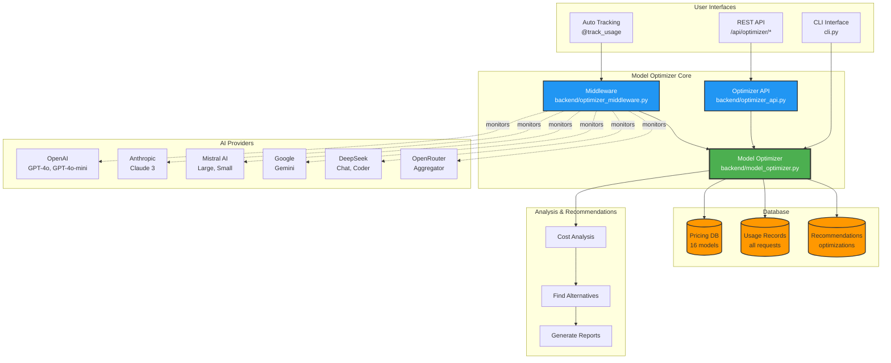

# Model Optimizer Architecture

## Components

### 1. User Interfaces
- **CLI Interface**: Menu items 7, 8, 9 in `cli.py`
- **REST API**: 8 endpoints at `/api/optimizer/*`
- **Auto Tracking**: Decorator `@track_usage` for automatic logging

### 2. Core Engine
- **Model Optimizer**: Main optimization logic
- **Middleware**: Transparent usage tracking
- **API Layer**: HTTP endpoints for external access

### 3. Database Layer
- **Pricing DB**: 16 models, 6 providers
- **Usage Records**: Every AI request logged
- **Recommendations**: Optimization suggestions

### 4. AI Providers (Monitored)
- OpenAI (GPT-4o, GPT-4o-mini, GPT-4-turbo, GPT-3.5-turbo)
- Anthropic (Claude 3 Opus, Sonnet, Haiku)
- Mistral AI (Large, Medium, Small)
- Google (Gemini 1.5 Pro, Flash)
- DeepSeek (Chat, Coder)
- OpenRouter (Aggregator)

### 5. Analysis Pipeline
1. **Cost Analysis**: Calculate real costs
2. **Find Alternatives**: Search cheaper options
3. **Generate Reports**: Detailed recommendations

## Data Flow

```
Request → Middleware → Log Usage → Database
                              ↓
                        Cost Analysis
                              ↓
                     Find Cheaper Alternative
                              ↓
                       Generate Recommendation
                              ↓
                        Return to User
```

## Example Workflow

```python
# 1. User calls AI function
@track_usage("openai", "gpt-4o", "content_generation")
def generate_content(prompt):
    return ai_response

# 2. Middleware logs automatically
# provider: openai, model: gpt-4o
# input_tokens: 1000, output_tokens: 500
# cost: $0.00750

# 3. Later, get recommendations
recommendations = optimizer.analyze_and_recommend(30)

# 4. Result:
# "Switch to google/gemini-1.5-flash"
# "Save 97% ($0.00728 per request)"
# "Quality impact: minimal"
```

## Key Metrics

- **Models Tracked**: 16
- **Providers**: 6
- **Potential Savings**: 70-97%
- **Overhead**: <1ms per request
- **Tests**: 16/16 passing

## Integration Points

1. **Flask App**: Automatic logging in `backend/app.py`
2. **CLI**: 3 menu items for stats/recommendations
3. **Middleware**: Drop-in decorator for any AI call
4. **API**: RESTful access for external tools

## Benefits

✅ **Transparent**: No code changes needed  
✅ **Accurate**: Real cost tracking  
✅ **Smart**: ML-ready recommendation engine  
✅ **Fast**: <1ms overhead  
✅ **Comprehensive**: 16 models, 6 providers
